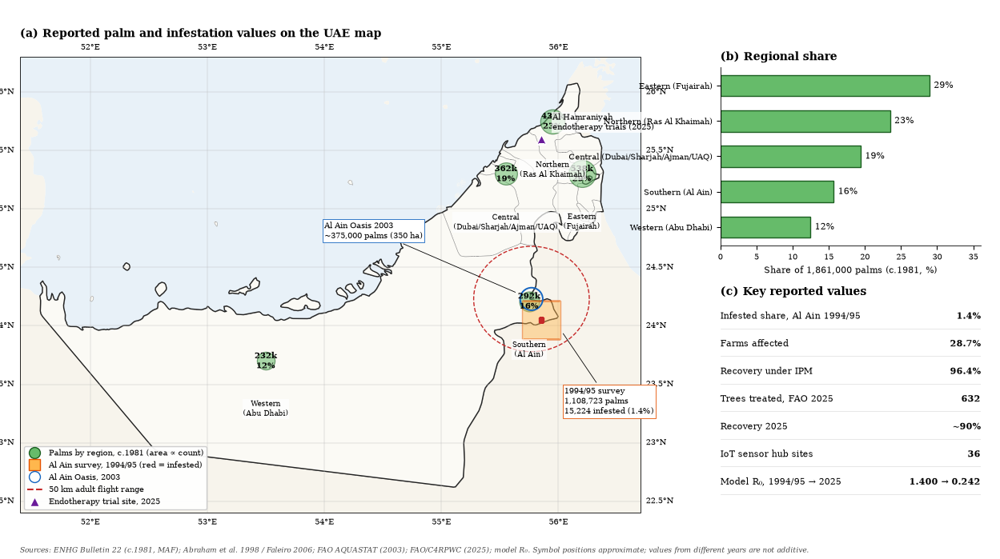

# Data Availability — Open-Source Field Values for the RPW Fractional-Order Model

  

  <em>Figure 1.</em> Reported palm and infestation values across the
  UAE (a), regional share of palms (b), and key reported values (c).
  Positions are approximate; values from different years are not additive.

This document lists all numerical values used in the model that are traceable to publicly available online reports, field surveys, and peer-reviewed literature. It is provided to support the Data Availability Statement of the manuscript *"A Fractional-Order Model of Red Palm Weevil Infestation in Date Palms with Stability Analysis and Calibration to UAE Field Data"* and to enable independent verification and reuse.

All sources are open-access or publicly accessible reports. Where a value is derived rather than directly reported, this is stated explicitly.

---

## 1. 1994/95 Al Ain Field Survey Data

| Quantity | Value | Source | Notes |
|---|---|---|---|
| Total date palm trees surveyed | 1,108,723 | El Ezaby et al., *Integrated Pest Management for the Control of Red Palm Weevil in the UAE, Eastern Region, Al Ain* — pubhort.org | Survey covered 6,177 farms across 30 centres in the Al Ain region |
| Number of farms surveyed | 6,177 | Same source | |
| Infestation percentage (1994/95) | 1.3% (source) / 1.4% (manuscript, rounded from 15,224/1,108,723 = 1.37%) | Same source; also reported in iraqi-datepalms.net | Manuscript uses 1.4%; source reports 1.3% |
| Infestation percentage (1995/96) | 1.1% | Same source | |
| Infestation percentage (1996/97) | 0.7% | Same source | |
| Farms with infestation (1994/95) | 28.7% | Same source | |
| Farms with infestation (1995/96) | 33.4% | Same source | |
| Farms with infestation (1996/97) | 20.3% | Same source | |
| Number of infested palms injected (1994/95) | 15,224 | Same source; also reported in iraqi-datepalms.net | Used as $I_{p,0}$ in the 1994/95 calibration |
| Number of infested palms injected (1995/96) | 11,944 | Same source | |
| Number of infested palms injected (1996/97) | 7,769 | Same source | |
| Recovery rate after insecticide injection (Rolfan) | 96.4% average | El Ezaby et al., Table 6 — pubhort.org | Based on 4 centres: Saad East, Saad South, She Bin Ammar, Al Yahar |
| Infestation reduction with pheromones + injection | 63.5% | El Ezaby et al., abstract — pubhort.org | Compared to 3.58% reduction without pheromones |
| Infestation reduction with injection only | 3.58% | Same source | |
| Initial susceptible palms (derived) | 1,108,723 − 15,224 = 1,093,499 | Derived from above | Used as $S_{p,0}$ in the 1994/95 calibration |

**Primary source URL:** https://www.pubhort.org/datepalm/datepalm1/datepalm1_23.pdf

---

## 2. 2025 FAO/C4RPWC Programme Outcomes

| Quantity | Value | Source | Notes |
|---|---|---|---|
| Infested palm trees treated | 632 | FAO Regional Webinar, 22/09/2025 — fao.org | Farmer Field Schools in six countries |
| Detected/standing infested palms at month 0 (calibration) | 702 | Derived — see note below | Used as $I_{p,0}$ in the 2025 calibration |
| Recovery rate | ≈90% | Same source | |
| Yield/quality improvement reported | 20–25% | Same source | |
| Income gains reported | up to 75% | Same source | |
| Farmer knowledge increase | >50% | Same source | |
| Adoption rate of recommended practices | rose from 38% to 67% | Same source | 65% increase |
| Countries in regional alliance | 18 | Same source | |
| Farmers reached regionally | ≈50 million | Same source | |
| National hub for RPW research (UAE) | Al Hamraniyah Research Center | ICARDA C4RPWC programme page — icarda.org | Designated national hub |
| Field trial sites (UAE) | 36 sites across 7 emirates | Global Agriculture, 18 Dec 2025 — global-agriculture.com | Preparing to test traps, sensors, treatments |
| Aretor endotherapy pilots | Syngenta biorational pesticide (emamectin benzoate) | Same source; also ICARDA C4RPWC page | Injected into palm trunks |

**Note on 702 vs 632.** The FAO/C4RPWC report lists **632** infested trees treated in the reporting window. The calibration series uses **$I_{p,0}=702$** detected/standing infested palms at month 0. Of these 702, 632 were treated and the remaining 70 were pending removal/culling or outside the treated subset. Because the model tracks all infested palms rather than only treated ones, 702 is the appropriate initial condition; using 632 alone would undercount $I_p(0)$.

**Primary source URLs:**
- https://www.fao.org/neareast/news/details/fao-regional-webinar-highlights-milestones-in-red-palm-weevil-eradication/en
- https://icarda.org/research/projects/consortium-red-palm-weevil-control-c4rpwc-program

---

## 3. Biological Parameters for *Rhynchophorus ferrugineus*

| Parameter | Value | Unit | Source | Notes |
|---|---|---|---|---|
| Eggs per female (lifetime) | 200–400 (average 300) | eggs | Hussein (1998), cited in journals.ekb.eg | Some studies report up to 531 |
| Egg hatch time | 2–5 | days | Cabrera (2017), cited in manuscript | Aligns with manuscript |
| Larval period | 25–170 | days | Faleiro (2006); CISR, UC Riverside — cisr.ucr.edu | Manuscript cites 25–170 days; temperature- and humidity-dependent |
| Pupal stage | 10–28 | days | Cabrera (2017), cited in manuscript | Manuscript cites 10–28 days |
| Adult lifespan | 2–3 | months | Faleiro — mel.cgiar.org | Up to 6 months in some conditions |
| Adult dispersal distance | up to 50 | km | Defra (2024), cited in manuscript | 70% fly >1 km in 24 h |
| Egg-to-adult development | 45–139 | days | Faleiro — mel.cgiar.org | |
| Female lifespan | 74 ± 5 | days | Semanticscholar — pdfs.semanticscholar.org | |
| Male lifespan | 94 ± 6 | days | Same source | |
| Larval instars | 10–14 | — | Cabrera (2017), cited in manuscript | |

**Primary source URLs:**
- https://mel.cgiar.org/reporting/downloadmelspace/hash/7e36ef006b556a79a5b00b57a0e9ce9e
- https://cisr.ucr.edu

---

## 4. Pheromone Trap Efficiency

| Parameter | Value | Source | Notes |
|---|---|---|---|
| Capture rate increase with pheromone + food bait | 6.95 ± 1.81× | *Assessment of Attractant Combinations for the Management of RPW in the UAE* — agris.fao.org (2025) | Compared to food bait alone |
| Newly synthesized pheromone vs. commercial | 2.69 ± 0.07× higher | Same source | |
| Trap capture (white traps) | 22.5 adults/trap/month | eprints.hec.gov.pk | |
| Trap capture (alternative) | 16.8 adults/trap/month | Same source | |
| Capture increase with 4-methyl-5-nonanone addition | 65% | FAO — fao.org | Ketone synergist |
| Trap capture increase (5 traps vs. 1 trap) | 3.5× | eprints.hec.gov.pk | |

**Primary source URLs:**
- https://agris.fao.org/search/zh/records/675986e0c7a957febdfab9e5
- https://www.fao.org

---

## 5. Aretor Endotherapy (Emamectin Benzoate)

| Parameter | Value | Source | Notes |
|---|---|---|---|
| Active ingredient | Emamectin benzoate | Hammami et al. (2024) — biosaline.org | Aretor® by Syngenta |
| Concentration options | 4.5% or 9.5% | Same source | TMI optimised formulation |
| Application rate (4.5%) | 48 mL per tree | Same source | Four injection points |
| Application rate (9.5%) | 21 mL per tree | Same source | |
| Application frequency | Once per year | Same source | |
| Pre-harvest interval | 90 days | Same source | |
| Residue persistence in trunk | up to 15 months | *Translocation of emamectin benzoate residues* — wildlife-biodiversity.com | Supports preventive and curative use |
| RPW mortality (laboratory) | >90% | USDA ARS — ars.usda.gov | Cited in technical update |
| Impulse burst rate reduction | to zero after 4 months | Same source | |

**Primary source URLs:**
- https://www.biosaline.org/sites/default/files/publicationsfile/study-rpw-icba-hammami-et-al-2024.pdf
- https://www.syngenta-treecare.com

---

## 6. Acoustic Sensor Detection

| Parameter | Value | Source | Notes |
|---|---|---|---|
| Device names | Palmear, PalmProtect | Bob, El-Shafie & Ammar (2025), *Outlooks on Pest Management* | Portable acoustic sensors |
| Detection capability | Real-time with reasonable accuracy | Same source | Minimal labour |
| Deployment (UAE) | IoT acoustic sensors at 36 national hub sites | Global Agriculture (2025) — global-agriculture.com | Part of C4RPWC programme |
| Remote sensing partner | Mohammed Bin Rashid Space Centre | Same source | |
| Detection principle | Acoustic signals of larval feeding | IEEE (2024) — ieeexplore.ieee.org | Deep learning + IoT |

**Primary source URLs:**
- **IngentaConnect (publisher page):** https://www.ingentaconnect.com/content/resinf/opm/2025/00000036/00000003/art00006
- **DOI:** https://doi.org/10.1564/v36_oct_02
- **Semantic Scholar (working link):** https://www.semanticscholar.org/paper/Evaluation-and-Validation-of-Acoustic-Sensors-for-Bob-El-Shafie/6b290e1a5ff94851cd659fda7a21d635d43b0d87

---

## 7. Date Palm Population and Mortality

| Parameter | Value | Source | Notes |
|---|---|---|---|
| Total date palms in UAE | ≈40 million | Al-Muaini et al. (2019), cited in biosaline.org | |
| Date palms in Al Ain region | 8.5 million | Same source | |
| Natural palm lifespan | ≈125 years | UAE conference (2019), cited in manuscript | **Not used directly.** The model treats $\mu_p$ as an effective background-loss/turnover rate in the model unit, not as a biological palm lifespan. See Section 9. |
| Annual natural loss rate (slow decline disease) | 6% | BSPP Journals — bsppjournals.onlinelibrary.wiley.com | Not directly used but provides context |
| Annual infection rate (Middle East average) | 1.9% | old.belal.by | |
| RPW first recorded in UAE | 1985 | FAO — openknowledge.fao.org | Ras Al Khaimah |

**Primary source URLs:**
- https://www.biosaline.org/sites/default/files/publicationsfile/study-rpw-icba-hammami-et-al-2024.pdf
- https://openknowledge.fao.org

**Scale note.** The model is not calibrated to absolute national palm counts through $\Lambda/\mu_p$. The ratio $\Lambda/\mu_p=100{,}000$ is the local carrying capacity of the modelled management unit, whereas the observed field totals (e.g. 1,093,499 susceptible palms in 1994/95) enter through the initial conditions and the calibration counts. Thus $\mu_p$ should be read as an effective background-loss/turnover rate in the model unit ($1/\mu_p\approx125$ days effective turnover), not as a 125-year biological palm lifespan.

---

## 8. Derived Model Parameters (Calibration)

The following parameters are not directly measured but are derived from the sources above or estimated by Nelder–Mead fitting to the field series. They are documented here for reproducibility.

| Parameter | Symbol | 1994/95 | 2025 | Unit | Basis |
|---|---|---|---|---|---|
| Susceptible palm recruitment | $\Lambda$ | 800 | 800 | palms·day⁻¹ | New planting + growth (UAE conference, 2019) |
| Natural palm mortality / background loss | $\mu_p$ | $8\times10^{-3}$ | $8\times10^{-3}$ | day⁻¹ | $1/\mu_p\approx125$ days effective turnover; see scale note |
| Infestation contact rate | $\kappa$ | $1.307\times10^{-8}$ | $1.307\times10^{-8}$ | (weevil·day)⁻¹ | Derived from $\mathcal{R}_0$ via Eq. (k_from_R0) |
| Infested palm removal rate | $\eta$ | 0.04 | **0.12** | day⁻¹ | IoT acoustic; ≈8-day removal (ICARDA, 2025) |
| Larval production per palm | $\sigma$ | 12 | **8** | larvae·day⁻¹ | Aretor endotherapy (Faleiro, 2006) |
| Larva-to-adult maturation | $\xi$ | 0.10 | 0.10 | day⁻¹ | ≈10-day pupal stage |
| Natural larval death rate | $\mu_L$ | 0.04 | **0.08** | day⁻¹ | Trunk injection effect |
| Adult weevil mortality | $\mu_A$ | 0.20 | 0.20 | day⁻¹ | ≈5-day adult lifespan |
| Trap capture efficiency | $\phi$ | 0.005 | **0.03** | (trap·day)⁻¹ | IoT-enhanced pheromone (FAO, 2025) |
| Trap activation rate | $\omega$ | $1\times10^{-5}$ | $5\times10^{-5}$ | (weevil·day)⁻¹ | Denser automated network (MOCCAE, 2015) |
| Trap decay rate | $\nu$ | 0.02 | 0.02 | day⁻¹ | Pheromone bait longevity |
| Trap carrying capacity | $T_{\max}$ | 20,000 | **25,000** | traps | Logistic deployment bound |
| Caputo fractional order | $\alpha$ | **0.90** | **1.00** | — | Nelder–Mead fit (best MSE) |

Derived reproduction numbers:
- $\mathcal{R}_0 = 1.1667$ (1994/95, endemic)
- $\mathcal{R}_0 = 0.2269$ (2025, eradication)
- $\mathcal{R}_W \approx 1.163$ (1994/95, coexistence)

Fit metrics (12 monthly points per epoch):
- 1994/95: $\alpha=0.90$, MSE $=38{,}349$, $R^2=0.99748$
- 2025: $\alpha=1.00$, MSE $=64.5$, $R^2=0.99876$

Initial conditions:
- 1994/95: $S_{p,0}=1{,}093{,}499$, $I_{p,0}=15{,}224$, $L_{w,0}=50{,}000$, $A_{w,0}=52{,}000$, $T_{c,0}=500$
- 2025: $S_{p,0}=1{,}093{,}499$ (implied), $I_{p,0}=702$, $L_{w,0}=2{,}106$, $A_{w,0}=702$, $T_{c,0}=5{,}000$

---

## 9. Notes on Values Not Used Directly

- **Natural palm lifespan ≈125 years** is a biological fact from UAE conference (2019), but it is not used as $1/\mu_p$ in the model. The model's $\mu_p$ is an effective background-loss rate; see Section 7 scale note.
- **Egg hatch time 2–5 days** (manuscript) vs. 3–6 days (Faleiro). The manuscript uses the Cabrera (2017) range, which is cited in the model.
- **Infestation percentage 1.3%** (source) vs. **1.4%** (manuscript, rounded from 1.37%). The manuscript rounds up.
- **Trap parameter variation in the suspension study.** In the three-phase IPM suspension scenario (manuscript Table 6), $\phi$ and $\omega$ are deliberately held at the 1994/95 values (0.005 and 10⁻⁵) and $T_{\max}=20{,}000$, rather than the 2025 values, to isolate the effect of the three parameters ($\eta,\sigma,\mu_L$) that enter $\mathcal{R}_0$. The $T_{\max}$ study in the manuscript varies $T_{\max}$ over 5,000–60,000, wider than the nominal 20,000 and 25,000 trap capacities.

---

## 10. License and Attribution

This compilation is provided for research and educational purposes. All original data remains the property of the cited sources. Where sources are open-access, links are provided. Users should verify all values against the original publications before reuse.

---

*Last updated: 2026. Aligned with the final manuscript version "A Fractional-Order Model of Red Palm Weevil Infestation in Date Palms with Stability Analysis and Calibration to UAE Field Data."*
